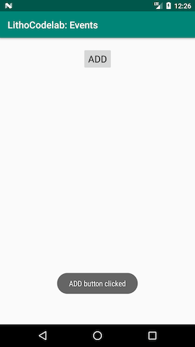

# 1. Overview

In this codelab, you'll learn about events: how to declare them, bind them to components, react to events and creating custom events.

### Prerequisites:
- `LayoutSpec`s
- State Updates

# 2. Setup the environment

Clone the following repo: [https://github.com/facebook/litho/tree/master/codelabs/events](https://github.com/facebook/litho/tree/master/codelabs/events)

# 3. Add `ClickEvent` and show message

In this part we will see how to add `ClickEvent` declaration and corresponding handler to the component. The screen will contain "ADD" button and it should show `Toast` message when clicked.

## Add button component
First, let's create a separate component for button so that we can reuse it later. In our case button is just a styled `Row` containing `Text` component:
#### ButtonSpec.kt
```kotlin 
@LayoutSpec
object ButtonSpec {

  @OnCreateLayout
  fun onCreateLayout(c: ComponentContext, @Prop text: String): Component {
    return Row.create(c, 0, R.style.Widget_AppCompat_Button_Small)
        .child(
            Text.create(c)
                .alignSelf(YogaAlign.CENTER)
                .textSizeSp(20f)
                .text(text))
        .build()
  }
}
```

## Define `ClickEvent`
Now, let's switch to main component to define our layout. We add our `Button` component and align it horizontally to the center.

#### RootComponentSpec.kt
```kotlin
@OnCreateLayout
fun onCreateLayout(c: ComponentContext): Component {
  return Column.create(c)
      .paddingDip(YogaEdge.ALL, 20f)
      .child(
          Button.create(c)
              .alignSelf(YogaAlign.CENTER)
              .text("ADD"))
      .build()
}
```

To declare event in your component you need to add a function annotated with `@OnEvent`. That annotation accepts the class value of event type, and here we will use predefined event type for clicks: `ClickEvent`. The function will accept `ComponentContext` and any prop or state as params. We will show `Toast` message when click event is triggered:

#### RootComponentSpec.kt
```kotlin
@OnEvent(ClickEvent::class)
fun onClickEvent(c: ComponentContext) {
  Toast.makeText(c.androidContext, "ADD button clicked", Toast.LENGTH_SHORT).show()
}
```

## Add click handler to component

We now have an event declaration which on its own does not do anything. We need to bind that event to the component that will trigger it. In our case we need to add `.clickHandler` to our `Button` component and it accepts `EventHandler<ClickEvent>` type. In order to add event handler we need to first compile our code so that the generated component (`RootComponent`) contains event handler function that points to `onClickEvent` we declared earlier. We need this level of indirection so that the generated component can prefill `Prop` and `State` values that could have been declared in `onClickEvent` and provide a method where you only pass `ComponentContext`:

#### RootComponentSpec.kt
```kotlin
Button.create(c)
    .alignSelf(YogaAlign.CENTER)
    .text("ADD")
    .clickHandler(RootComponent.onClickEvent(c)))
```  

## Click event in action

We have now all pieces together and the interaction looks like the following:



The next step will be to trigger state update and perform some action in response to click.

# 4. Trigger state update on click event

# 5. Add `@Param` to `OnEvent`

# 6. Add custom event

# 7. Add params to custom event

# 8. Add visible and invisible events

# 9. Summary


